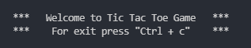
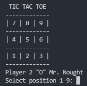
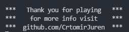

## TIC TAC TOE _(PYTHON GAME IN TERMINAL)_
___

Project to help begginers improve ⭐ on python application structures. 

Have fun 🎉 while learning and improving your code.


## GAME 🎮 PSEUDOCODE 
___
```

game_start()
    create player
    create board
    select random player

game_play()
    while
        display board
        get player input
        set board cell by player input

        check if win
            check win by rows
            check win by columns
            check win by diagonals

        if no win check if tie

        if game over
            break
        else
            change to next player

game_end()

```

## GAME GRAPHICS 📺
___

**Welcome screen** 👋
  


**Player turn**



**Goodbye screen**




## LEVEL 1 BEGGINER 🌘
___
- Application is not error safe
- Using global variables 
- Debbuging is done with print()
- Hint: global variables are bad in any programming language. Try to avoid if possible
- Hint: Global constants are OK


## LEVEL 2 ADVANCED 🌗
___
- Functions start to use input and output
- Completely remove global variables
- stop using print(). because you need to delete, comment it while debbuging
- Debbugging done with logging module. One mode for development and one for official application


## LEVEL 3 PRO 🌕
___
- !!! application must be **STABLE**, error safe 🔨 and survive weird user inputs 🔑 !!!
- OOP object oriented programming
- This OOP application is the bassis for any board game. Chess, checkers... 
- application is run from --> launcher.py
- every object is in its own file
- all objects have logging module that inherits from a single base_logger
- when debugging, we can see file source of every log message
- DONT DO THIS --> from constants import * . USE --> import constants
- Know source of every function and constant. BETTER TO USE constants.DEBUG, than just DEBUG

<!---
### RUNNING TESTS
___

*TO RUN ALL TESTS*
- > tic-tac-toe-terminal\3 pro>python run_tests.py
- > tic-tac-toe-terminal\3 pro>python -m unittest
- > tic-tac-toe-terminal\3 pro>python -m unittest discover

*TO RUN A SINGLE TEST*
- > tic-tac-toe-terminal\3 pro>python -m unittest test.test_cell
- > tic-tac-toe-terminal\3 pro>python -m unittest test.test_baord
- > tic-tac-toe-terminal\3 pro>python -m unittest test.test_game


0.arhitekturo samo razložim ker je komplicirana:
- logging module
- keypress interrupt
- celotno igro pišemo v funkcijo game()
- malo potestiraš kako deluje

1.korak: 
- napiši osnovno logiko igre
- logika je prikazana z eno simulacijo igre med dvema na tabli

2.arhitektura igre:
- arhitektura iger je taka da si v while zanki, dokler je ni konec 
- torej da nam ne bo igra zaloopala v while zanki

LOGIKA:
- stopiš pred tablo
- najprej narišeš prazno 3x3 šahovnico
- izžrebaš kdo bo začel igro X ali O
Potem zaženeš game loop
- igralec 1 nariše X
- preveriš pogoje za konec igre
- igralec 2 nariše 0
- preveriš pogoje za konec igre
- igralec 1 nariše X
- preveriš pogoje za konec igre
- igralec 2 nariše 0
...
- ko je pogoj konca izpolnjen, konec igre

3.korak:
- naredi board 1D list strukturo in print empty board
- funkcija display board

4.korak:
- razumevanje list operacij
- je en list board = 9*["-"]. kako sedaj dobiš vrstice, kako stolpce, kako diagonale

## main_v2
dodaš funkcijo get row, get column
- board je sestavljen iz 2D array numpy
- na temu numpy arrayu delaš in preverjaš logiko
0-prazno, 1-user1, 2-user2
--->
